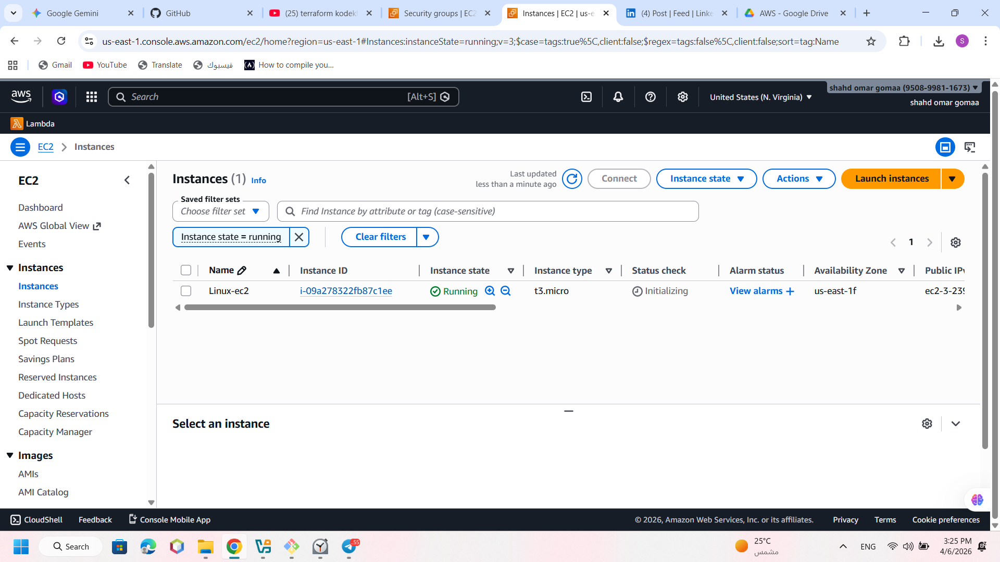
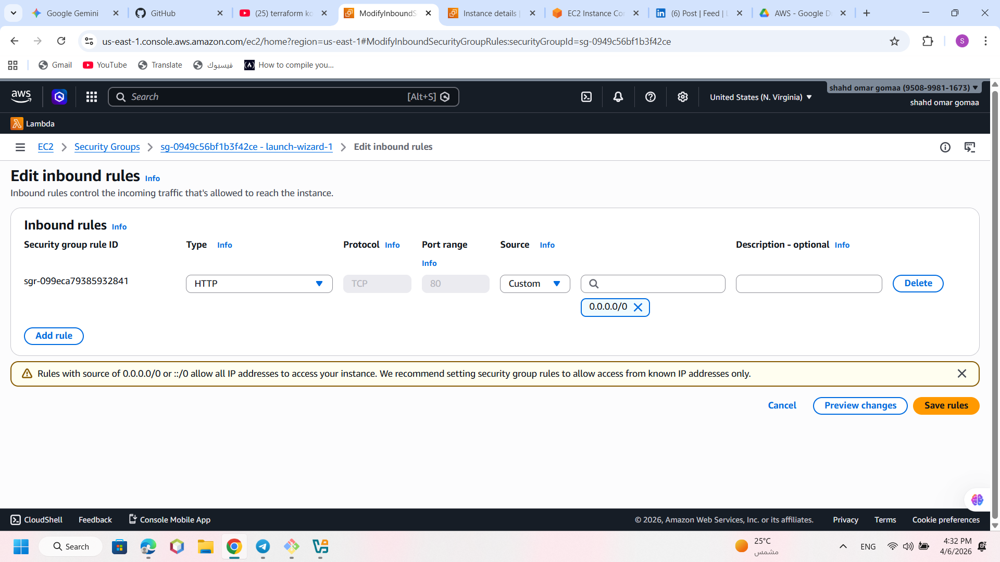

# AWS Cloud Infrastructure Deployment & Web Hosting
**Technical Documentation | Cloud & Linux Support Operations**

---

## 📌 Executive Summary
This project demonstrates the architectural design and deployment of a secure, Linux-based web infrastructure on **Amazon Web Services (AWS)**. The objective was to provision a cloud environment, configure network security protocols, and host a professional landing page using industry-standard web services.

## 🛠 Technical Specifications
* **Cloud Provider:** Amazon Web Services (AWS)
* **Instance Tier:** EC2 (Elastic Compute Cloud) - t3.micro
* **Operating System:** Ubuntu 24.04 LTS (HVM)
* **Web Server Engine:** Apache HTTP Server (Apache2)
* **Networking:** VPC Default, Public IPv4 Routing
* **Security Framework:** Inbound/Outbound Security Groups (Stateful Firewall)

---

## 🏗 Implementation Phases

### Phase 1: Infrastructure Provisioning
Launched a high-performance Ubuntu instance. Configured **RSA 2048-bit Key Pairs** to ensure secure SSH administrative access.
> 

### Phase 2: Network Security & Firewall Configuration
Implemented granular security rules by modifying the **AWS Security Group**. Enabled **Inbound Port 80 (HTTP)** to allow public web traffic and **Port 22 (SSH)** for remote management.
> 

### Phase 3: Web Service Integration (Apache2)
Managed the server backend via CLI to update system repositories and install the **Apache2** service. Verified service status and handled ownership permissions for the web root directory.
> 

### Phase 4: Production Deployment
Deployed a responsive HTML5/CSS3 interface into the production directory (`/var/www/html/`). The deployment confirms successful end-to-end connectivity between the cloud instance and the global internet.
> 

---

## 🎯 Engineering Competencies Demonstrated
* **Cloud Resource Management:** Full lifecycle management of EC2 instances.
* **Linux System Administration:** Command-line expertise in Ubuntu environments.
* **Information Security:** Applying the principle of least privilege in Security Groups.
* **Documentation & Version Control:** Utilizing Git for technical project transparency.

---
**Prepared by:** **Shahd Omar Gomaa** *Cloud & Linux Support Specialist* *Computer Science Division*
